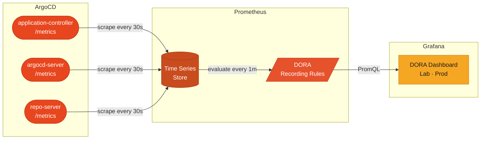

# DORA Metrics — ArgoCD + Prometheus + Grafana

Track Deployment Frequency, Change Failure Rate, Lead Time, and MTTR using your existing ArgoCD, Prometheus, and Grafana stack. No additional tools required.

---

## Architecture



---

## Files

| File | What it does |
|------|-------------|
| `servicemonitors.yaml` | Tells Prometheus to scrape ArgoCD's three metric endpoints every 30s |
| `prometheusrule.yaml` | Pre-computes DORA recording rules every 1 min from raw ArgoCD metrics |
| `grafana-dashboard-configmap.yaml` | Grafana dashboard with an `Environment` dropdown (lab / prod) — auto-loaded by the Grafana sidecar |
| `argocd-application.yaml` | ArgoCD Application that manages all the above via GitOps (optional — see below) |

---

## Before you apply

### 1. Match your Prometheus label selectors

Prometheus Operator only picks up ServiceMonitors and PrometheusRules that match its configured selectors. Check yours:

```bash
kubectl get prometheus -n monitoring -o jsonpath='{.items[0].spec.serviceMonitorSelector}' | jq .
kubectl get prometheus -n monitoring -o jsonpath='{.items[0].spec.ruleSelector}' | jq .
```

Replace the `release: prometheus` label in `servicemonitors.yaml` and `prometheusrule.yaml` with whatever the above returns.

### 2. Set your namespaces

| File | Field | Default | Change to |
|------|-------|---------|-----------|
| `servicemonitors.yaml` | `metadata.namespace` | `argocd` | Your ArgoCD namespace |
| `prometheusrule.yaml` | `metadata.namespace` | `argocd` | Your ArgoCD namespace |
| `grafana-dashboard-configmap.yaml` | `metadata.namespace` | `monitoring` | Your Grafana namespace |

### 3. Set your Grafana sidecar label

The ConfigMap uses `grafana_dashboard: "1"`. Confirm your sidecar watches this label — it is the default for `kube-prometheus-stack`. If yours differs, update `metadata.labels` in `grafana-dashboard-configmap.yaml`.

### 4. Verify the Prometheus data source exists in Grafana

```bash
kubectl port-forward svc/grafana 3000:80 -n monitoring
# Grafana UI → Connections → Data Sources — confirm "Prometheus" is listed
```

---

## Deployment plan — Lab first, then Prod

The Grafana dashboard has a built-in **Environment** dropdown (`lab` / `prod`). It filters all panels by `dest_namespace` on ArgoCD app metrics, so a single dashboard covers both environments.

### Phase 1 — Lab

```bash
# Apply manifests to your lab cluster (or lab-scoped namespaces)
kubectl apply -f servicemonitors.yaml
kubectl apply -f prometheusrule.yaml
kubectl apply -f grafana-dashboard-configmap.yaml
```

Wait ~2 minutes, then verify:

```bash
# Confirm ArgoCD targets are being scraped
kubectl port-forward svc/prometheus-operated 9090:9090 -n monitoring
# Prometheus UI → Status → Targets — look for argocd entries

# Confirm recording rules are computing
# Prometheus UI → Status → Rules — look for "dora.rules"

# Confirm dashboard loaded
kubectl port-forward svc/grafana 3000:80 -n monitoring
# Grafana → Dashboards → search "DORA Metrics"
# Set the Environment dropdown to "lab" and confirm data appears
```

Validate the dashboard shows expected deployment counts for lab before proceeding.

### Phase 2 — Prod

Once lab looks correct, apply the same files to your prod cluster or prod namespaces:

```bash
kubectl apply -f servicemonitors.yaml
kubectl apply -f prometheusrule.yaml
kubectl apply -f grafana-dashboard-configmap.yaml
```

Switch the dashboard **Environment** dropdown to `prod` to see prod metrics. Both environments share the same dashboard — toggle between them to compare failure rates before and after a rollout.

### Optional — GitOps management via ArgoCD

If you want ArgoCD to manage these manifests going forward instead of manual `kubectl apply`:

1. Update `argocd-application.yaml` — replace `repoURL` and `path` with your repo details
2. Apply once:
   ```bash
   kubectl apply -f argocd-application.yaml
   ```

ArgoCD will keep all manifests in sync with this repo automatically.

---

## Dashboard — Environment variable

The dashboard `$environment` variable defaults to `lab`. All six panels filter ArgoCD metrics by `dest_namespace=~".*$environment.*"` — meaning your ArgoCD app destination namespaces should contain the string `lab` or `prod` (e.g. `app-lab`, `payments-prod`). Adjust the regex in the dashboard JSON if your naming convention differs.
